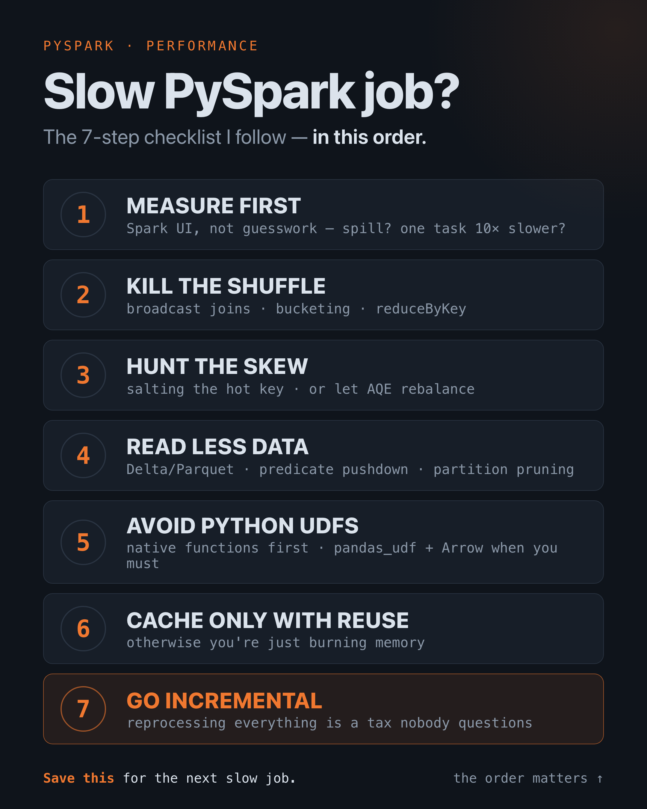

# PySpark Optimization Playbook

**🇧🇷 Português** · [🇬🇧 English](README.md)

Um job Spark lento quase nunca significa "precisamos de um cluster maior".
Significa que o job está fazendo trabalho que não precisava — geralmente um
shuffle que dava pra evitar, uma partição que dava pra podar, ou um histórico
inteiro que ele reprocessa toda noite.

Este repo é um **checklist executável**. Cada passo é uma demo pequena e
autocontida que roda uma versão *ingênua* e uma versão *otimizada* pelo mesmo
harness de benchmark, pra que a diferença seja um número que você lê — não uma
afirmação em que você tem que confiar. Toda otimização também vem com um teste
que verifica que ela devolve o **mesmo resultado** da versão ingênua, porque uma
query mais rápida que muda a resposta é pior que inútil.

A ordem importa. Trabalhe de cima pra baixo: meça primeiro, e não ajuste o passo
5 antes de ter descartado os passos 1–4.

## O checklist

| # | Passo | A ideia central | Demo |
|---|-------|-----------------|------|
| 1 | **Meça primeiro** | Leia o plano e o Spark UI antes de mudar uma linha. O stage mais longo é o seu gargalo; chutar desperdiça o ajuste. | [`01_measure.py`](demos/01_measure.py) |
| 2 | **Mate o shuffle** | Um shuffle move dados pela rede pra reagrupar por chave — a coisa mais cara que a maioria dos jobs faz. Faça broadcast do lado pequeno do join e o lado grande nunca se move. | [`02_shuffle.py`](demos/02_shuffle.py) |
| 3 | **Cace o skew** | Uma chave quente = uma partição gigante = uma task retardatária. Deixe o AQE dividi-la, ou faça salting da chave em N sub-chaves e agregue em dois estágios. | [`03_skew.py`](demos/03_skew.py) |
| 4 | **Leia menos dado** | A leitura mais rápida é a que nunca acontece. Partition pruning e predicate pushdown pulam arquivos e row-groups antes de decodificá-los. | [`04_read_less.py`](demos/04_read_less.py) |
| 5 | **Evite UDFs Python** | Uma UDF Python serializa cada linha pela fronteira JVM↔Python e bloqueia a otimização. Use funções nativas; quando não der, `pandas_udf` + Arrow envia lotes em vez de linhas. | [`05_avoid_udfs.py`](demos/05_avoid_udfs.py) |
| 6 | **Cache só com reuso** | O Spark recomputa um DataFrame a cada action. Faça cache quando um frame é reusado em ≥2 actions — nunca por hábito; isso só queima memória. | [`06_cache.py`](demos/06_cache.py) |
| 7 | **Vá incremental** | O que mais economiza e o desperdício menos questionado: processe só o que mudou, não o histórico todo. No Delta, um `MERGE INTO` por chave ainda torna isso idempotente. | [`07_incremental.py`](demos/07_incremental.py) |

<p align="center">
  
  <br><em>O checklist, em ordem — a ordem é o método: meça antes de ajustar, e descarte os ganhos baratos antes dos caros.</em>
</p>

## Como ler uma demo

Toda demo imprime o plano físico das duas versões e os tempos de relógio.
Aprenda a identificar isto na saída do plano — é onde o custo se esconde:

- **`Exchange`** → um shuffle. Menos é melhor.
- **`BroadcastHashJoin`** vs **`SortMergeJoin`** → o lado pequeno foi broadcast, ou o Spark está embaralhando os dois?
- **`PartitionFilters: [...]`** → o partition pruning entrou em ação; diretórios inteiros pulados.
- **`PushedFilters: [...]`** → o filtro chegou ao leitor Parquet em vez de rodar depois de um full scan.

## Como rodar

O Spark 3.5 roda em **Java 8, 11 ou 17** — não em JVMs mais novas (o Security
Manager de que ele depende foi removido no Java 24+). Cheque com `java -version`
e aponte o `JAVA_HOME` pra um Java 17 se precisar.

```bash
pip install -r requirements.txt

python generate_data.py          # gera ./data (~5M linhas; passe um número pra mudar)
python demos/02_shuffle.py       # roda qualquer passo
pytest -q                        # checa correção + "de fato mais barato"
```

Cada demo sobe um `SparkSession` local; enquanto uma roda, o Spark UI fica em
<http://localhost:4040> (o passo 1 mantém aberto pra você explorar).

## De onde isso vem

Esses são os movimentos que eu de fato uso, nessa ordem, num pipeline medalhão
(bronze → silver → gold) rodando no Databricks: o dado cru cai no S3, um job
PySpark deduplica e limpa pra silver, e outro agrega pra gold. A lição que mais
economizou tempo de relógio ali foi a nº 7 — a deduplicação da silver fazia um
full scan a cada rodada, até virar um merge incremental pela chave natural.

Os datasets aqui são sintéticos e determinísticos pra que qualquer um clone,
rode e veja os mesmos números.
